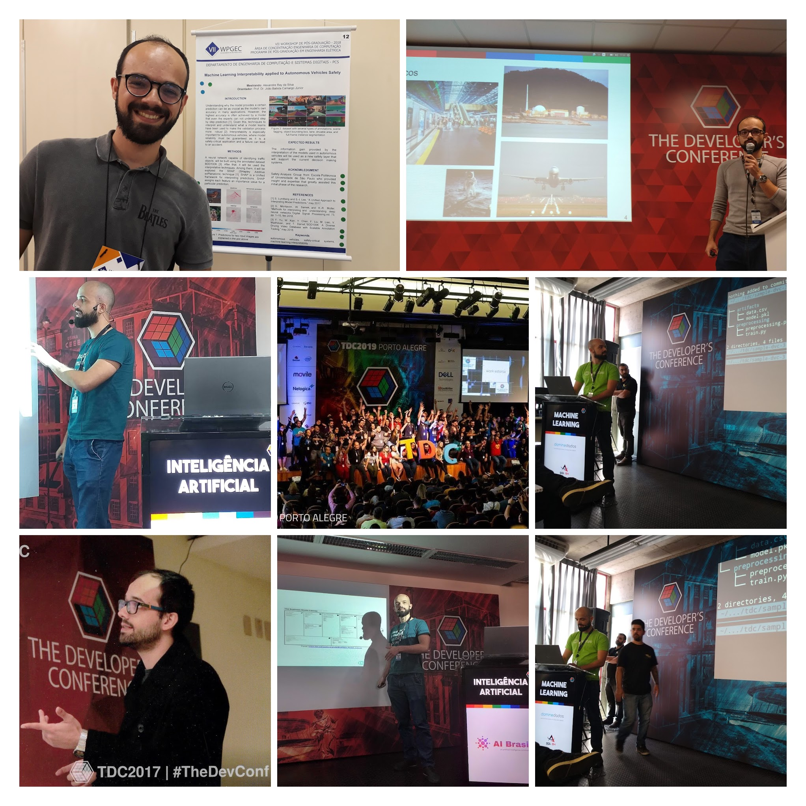

|   | Event                                                 | Date          | Title                                                                                                                                                                                                       |
|---|-------------------------------------------------------|---------------|-------------------------------------------------------------------------------------------------------------------------------------------------------------------------------------------------------------|
| 1 | TDC Porto Alegre                                      | December 2020 | Demystifying CNNs with Grad-CAM                                                                                                                                                                             |
| 2 | Guest Professor at Mackenzie Presbyterian University  | October 2020  | Blockchain Applied to Business                                                                                                                                                                              |
| 3 | TDC Porto Alegre                                      | November 2019 | [Machine Learning Canvas: From data collection to value proposition](https://www.slideshare.net/AlexandreRay1/machine-learning-canvas-da-coleta-de-dados-gerao-de-valor)                                    |
| 4 | TDC Porto Alegre                                      | November 2019 | [How to make versioning control of data and machine learning models using DVC?](https://www.slideshare.net/AlexandreRay1/como-fazer-controle-de-verses-de-dados-e-modelos-de-machine-learning-usando-o-dvc) |
| 5 | TDC São Paulo                                         | July 2018     | [Trends in the use of artificial intelligence in autonomous vehicles](https://www.slideshare.net/AlexandreRay1/tendncias-do-uso-da-inteligncia-artificial-em-veculos-autnomos)                          |
| 6 | TDC São Paulo                                         | July 2017     | [Fintechs: technology and inovation in financial services](https://www.slideshare.net/AlexandreRay1/fintechs-tecnologia-e-inovao-em-servios-financeiros)                                                    |

### Demystifying CNNs with Grad-CAM
*December, 2020 - The Developer's Conference Porto Alegre - Language: portuguese*

Description: Interpretabilidade em Deep Learning contribui para o aumento da confiança e da transparência nos sistemas que se baseiam nessas técnicas. Especialmente em sistemas críticos em segurança (safety-critical systems) como veículos autônomos ou veículos aéreos não tripulados. Nesse talk, vamos entender como explicar as predições de redes neurais convolucionais (CNNs) usando o Grad-CAM.

### Blockchain Applied to Business
*October, 2020 - Guest Professor at Mackenzie Presbyterian University - Language: portuguese*

Description: In this lecture I explained basic principles of the blockchain technology such as hash, ledger, public and private keys, proof-of-work and energy consumption.

### Machine Learning Canvas: From data collection to value proposition
*November, 2019 - The Developer's Conference Porto Alegre - Language: portuguese*

Description: Sistemas baseados em Machine Learning são complexos. É comum observar que alguns modelos não resolvem os problemas que deveriam resolver e acabam não sendo utilizados na prática. O Machine Learning Canvas visa levantar as informações principais para os projetos de Machine Learning. Neste mini talk, vamos explorar qual é esse caminho desde a coleta dos dados até a geração de valor.

Presentation [here](https://www.slideshare.net/AlexandreRay1/machine-learning-canvas-da-coleta-de-dados-gerao-de-valor).

### How to make versioning control of data and machine learning models using DVC?
*November, 2019 - The Developer's Conference Porto Alegre - Language: portuguese*

Description: Você já criou tantos datasets e tantos modelos que já não sabe mais quem é quem? Não lembra mais qual versão do modelo está em produção? Entrou mais um Cientista de Dados no projeto e ela/ele não consegue reproduzir os experimentos? Neste talk, iremos explorar como o Open Source Data Version Control (DVC) pode ajudar a resolver esses problemas.

Presentation [here](https://www.slideshare.net/AlexandreRay1/como-fazer-controle-de-verses-de-dados-e-modelos-de-machine-learning-usando-o-dvc).

### Maket with Data
*August, 2019 - Feira Mercado 2019 - Feira de Recrutamento e Seleção USP*

Description: In this talk, I spoke to college students about data carrer in data.

### Trends in the use of artificial intelligence in autonomous vehicles
*July, 2018 - The Developer's Conference São Paulo - Language: portuguese*

Description: Sistemas críticos em segurança têm potencial para produzir consequências catastróficas à sociedade, como mortes, ferimentos, danos ambientais e materiais. Desta forma, desenvolver e garantir que os sistemas críticos sejam seguros ao longo do seu ciclo de vida é uma missão da engenharia, ciência e tecnologia. Porém, novas tecnologias e paradigmas vem tornando obsoleta as abordagens de garantia de segurança de sistemas críticos. Entre elas, pode-se destacar o uso massivo e pervasivo de níveis avançados de Inteligência Artificial. Esta palestra abordará o estado da arte da aplicação da Inteligência Artificial em sistemas críticos em segurança, com ênfase em veículos autônomos.

Presentation [here](https://www.slideshare.net/AlexandreRay1/tendncias-do-uso-da-inteligncia-artificial-em-veculos-autnomos).

### Fintechs: technology and inovation in financial services
*July, 2017 - The Developer's Conference São Paulo - Language: portuguese*

Description: A era digital e da conectividade têm transformado profundamente a maneira como interagimos com o mundo ao nosso redor. Cada vez mais, precisamos estar por dentro das recentes tecnologias para que possamos ter algum tipo de vantagem, seja para ganhar tempo, aumentar a produtividade ou até mesmo para economizar dinheiro. No mercado financeiro, as Fintechs desenvolvem inovações tecnológicas voltadas para esse setor. Elas atacam problemas graves que temos no sistema financeiro brasileiro, como altas taxas de juros de empréstimos, burocratização e falta de transparência. Esta palestra abordará o contexto geral das Fintechs e trará uma visão de como elas estão inseridas em nosso cotidiano.

Presentation [here](https://www.slideshare.net/AlexandreRay1/fintechs-tecnologia-e-inovao-em-servios-financeiros).

 
---
My page on "The Developer's Conference" event: [here](https://thedevconf.com/palestrante/alexandre-ray-da-silva)

